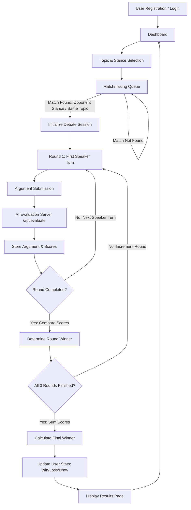
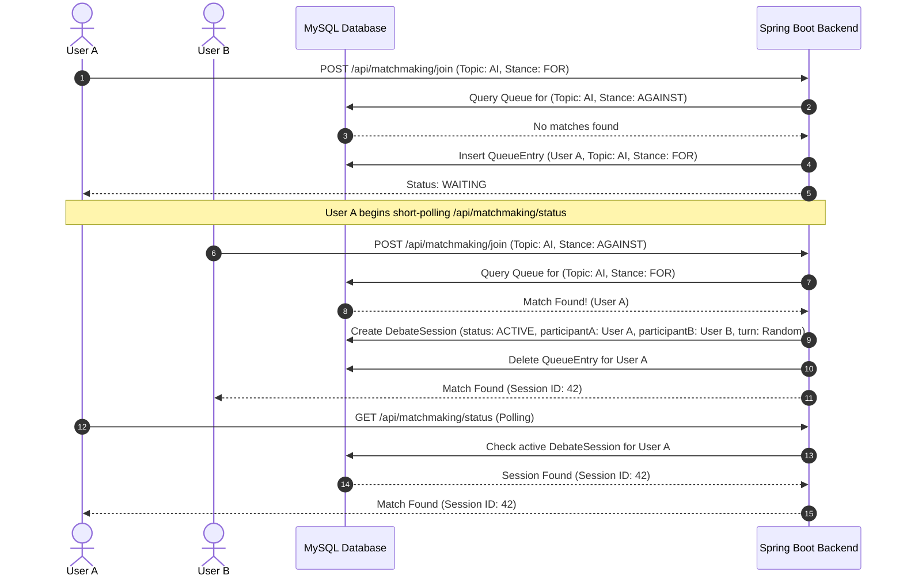

# Debait System Flow Documentation

This document describes the architectural flow, matchmaking state machine, and debate turn transitions using Mermaid diagrams.

---

## 1. High-Level Application Flow

The flow of a user from registration to finishing a debate and viewing updated statistics.

---

## 2. Matchmaking Queue Logic

A database-backed queue manages active connections matching users asynchronously.

---

## 3. Debate Turn State Machine (Round Progress)

Each round requires both users to submit one argument. Turn transitions are synchronized via polling.

```mermaid
stateDiagram-v2
    [*] --> RoundStart : current_round = 1
    
    state RoundStart {
        [*] --> Speaker1Turn : Randomly assigned starting speaker
        Speaker1Turn --> Evaluating1 : Speaker 1 submits argument
        Evaluating1 --> Speaker2Turn : AI evaluations saved; Switch active turn
        Speaker2Turn --> Evaluating2 : Speaker 2 submits argument
        Evaluating2 --> RoundComplete : AI evaluations saved
    }
    
    RoundComplete --> NextRound : Increment round; Check current_round <= 3
    RoundComplete --> DebateFinished : current_round > 3
    
    NextRound --> RoundStart
    DebateFinished --> [*] : Compute final winner & update stats
```

